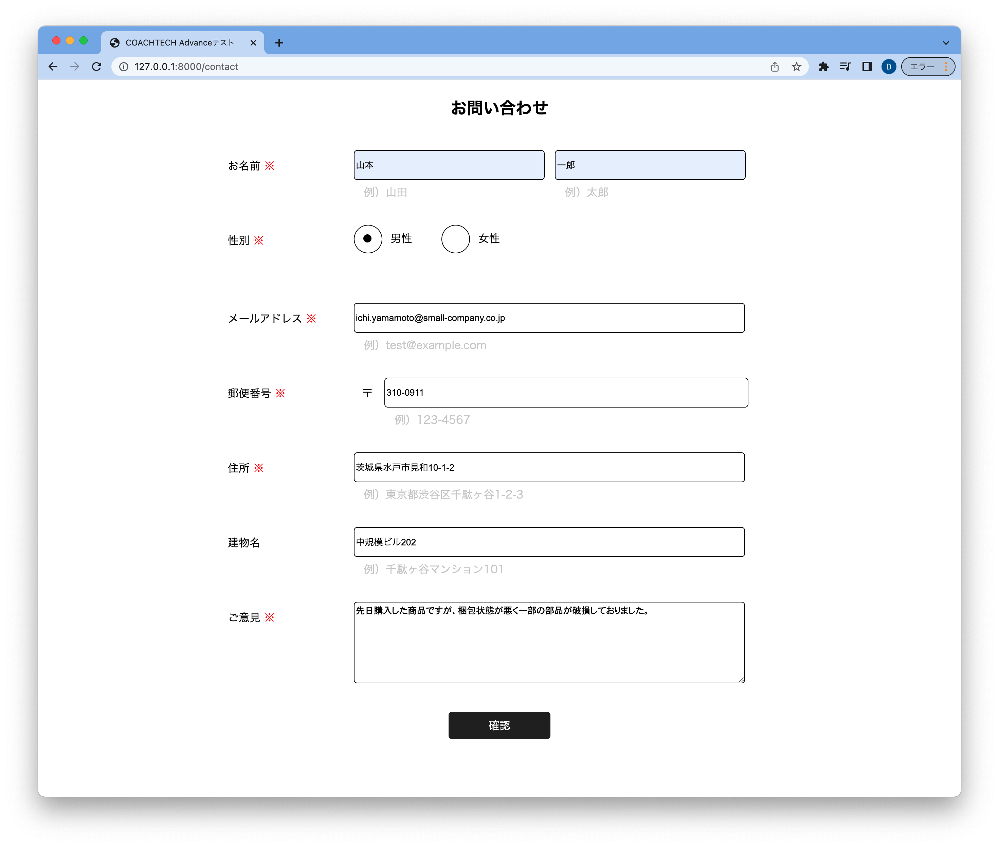
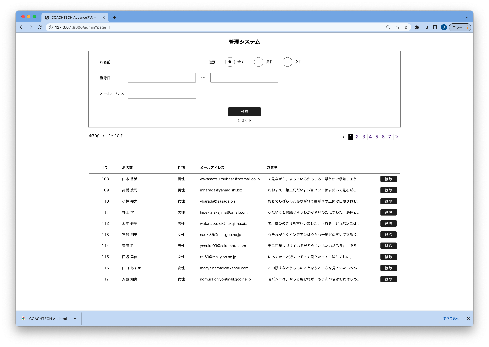

# お問い合わせ入力・内容管理サイト

概要説明：問い合わせ内容をWEB画面で入力、一覧管理するサイト

## 作成した目的

COAHCHTECH Advanceタームレベル分けテスト課題

## 機能一覧

- 問い合わせ内容入力
- 問い合わせ内容検査
- 問い合わせ内容削除

## 使用技術（実行環境）

- php 8.1.8
- Laravel　9.24.0

## URL

### 問い合わせ内容入力画面
- http://<サーバーアドレス>/contact

### 管理システム画面
- http://<サーバーアドレス>/admin
